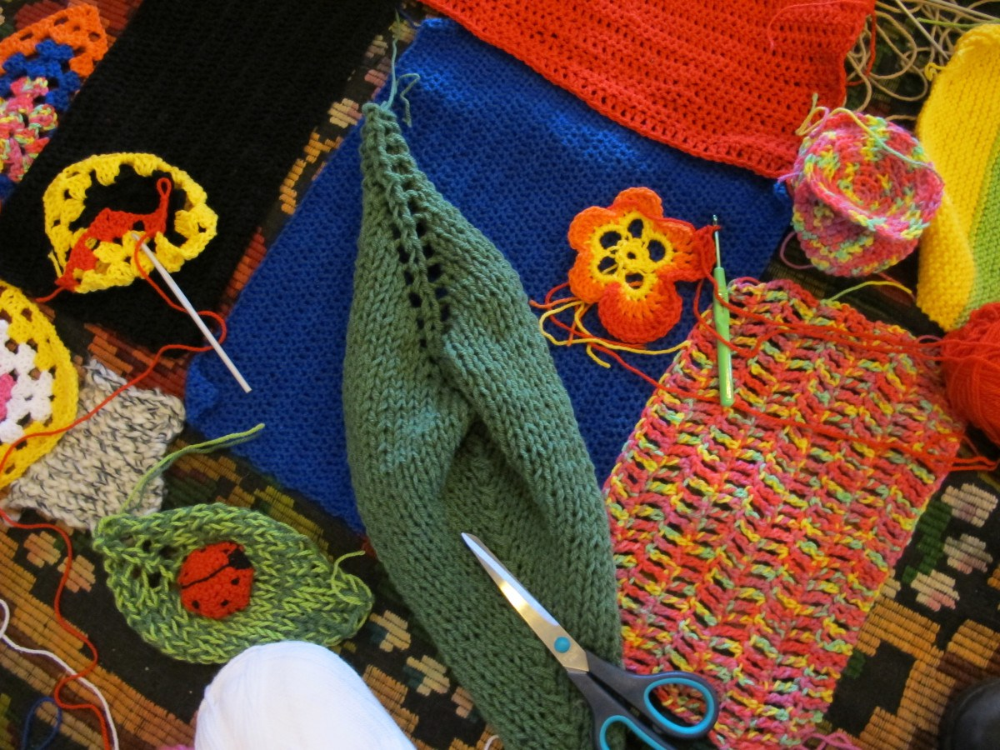
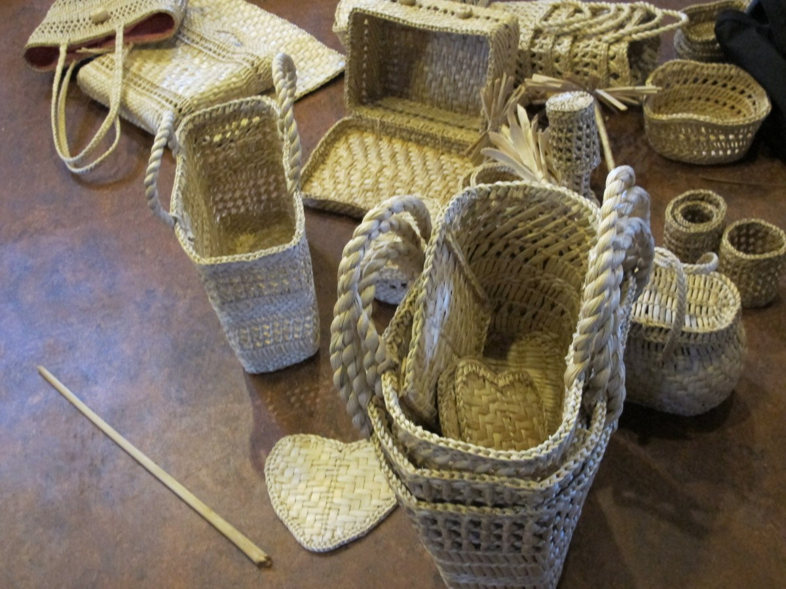
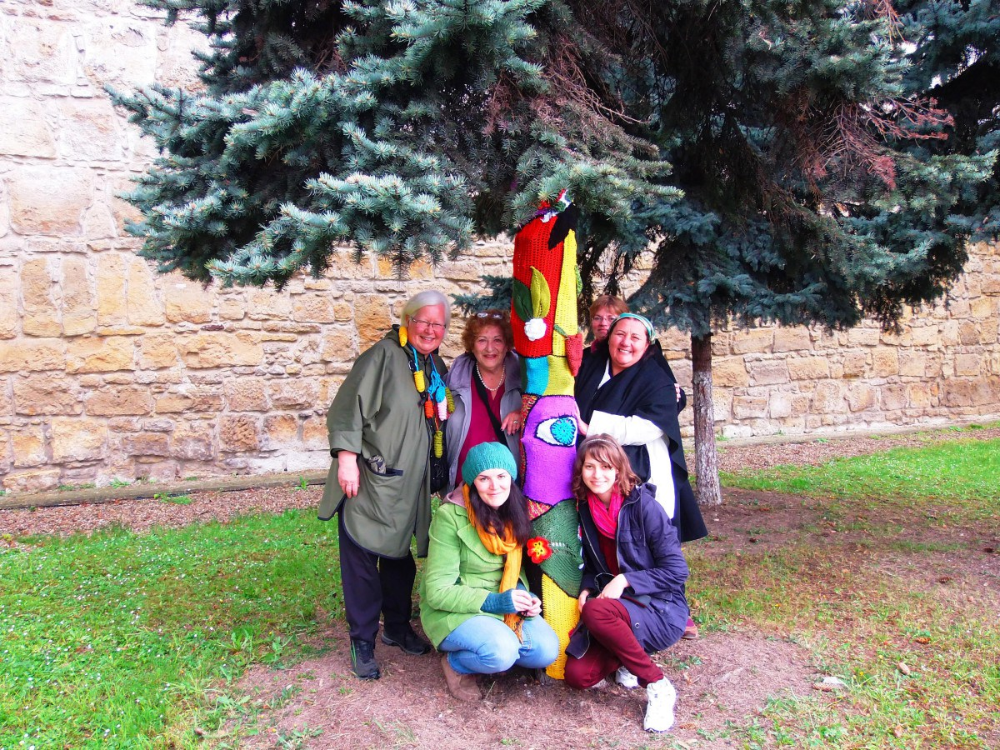
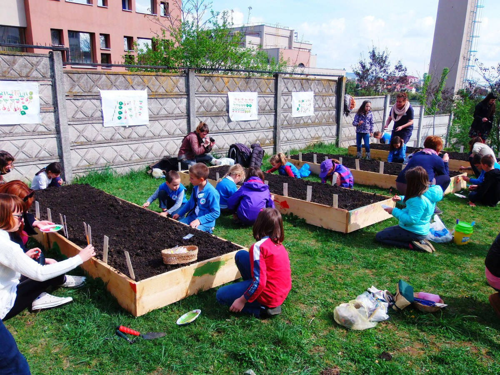
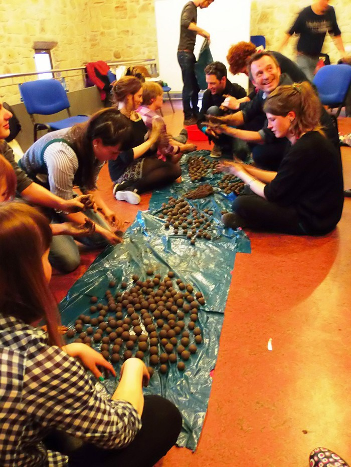
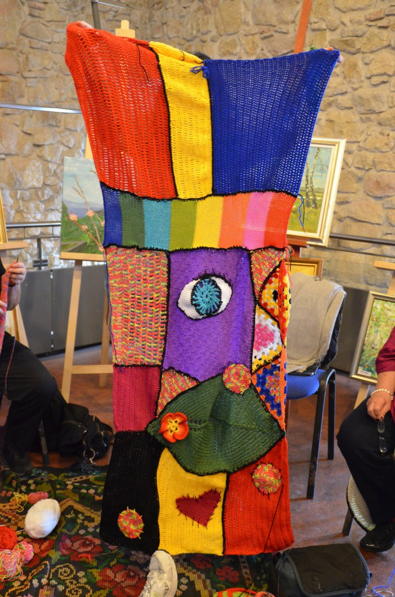
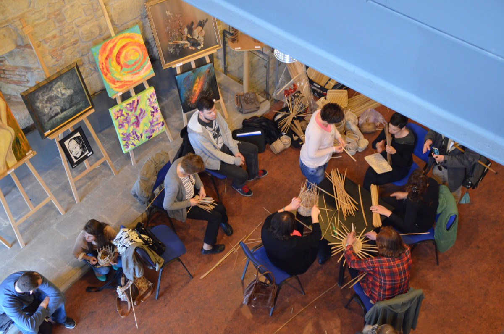

# 1st Workshop - Cluj Napoca, România
[Asociația uzinaduzina](http://uzinaduzina.org)
###Cluj-Napoca, Romania, April 2014
---

In Romania, in Cluj in April 2014, the meeting was attended by 30 participants from Dubrava in Croatia, Warsaw in Poland, Bordeaux in France and Brussels in Belgium, who participated in the meeting and in the various workshops offered by our Romanian partner «Asociatia Uzinaduzina». They experimented the art of wicker braiding, knitting to dress trees and producing seed bombs.

## Urban knitting.

Knitting was a widely spread handcraft among Romanian homemakers during the communiste era. Lack of clothes and the need to develop a personal style favored this pastime which is now timidly reviving. Nowadays the young population rediscovers knitting especially in their desire to gain a vintage look. More and more are retracing practices once common in their environments but give them a more urban and contemporary direction.

Urban and guerilla knitting is a way of reclaiming and personalizing sterile or cold public places. It is also telling a « stitched story » and, in Romania’s case, re-connecting two different types of society – the traditionalist with the contemporary one. Such an experience may provide a common storytelling environment which would allow an in-depths intergenerational dialogue.

Participants will learn how to knit large pieces of textile in a short time and how to prepare them for the urban environment. The knitting can take place at one of the participants house or an informal place, creating a temporary hub. Stories and recipes sharing or singing usually accompany this activity.

 https://www.youtube.com/watch?v=A36mWkPx_qM 

## Rush knitting.

Rush knitting is a vernacular activity, found in many parts of Romania and easy to learn. Used mostly for domestic objects, rush is an easily obtainable and manufacturable commodity, its knitting is a rewarding pastime in Romanian households.

Wickering may be associated with late autumn and winter activities when one normally limits the outdoor activities within the household. It also serves a social function as craftsmen gather, tell stories and work together. Craftsman usually develops a personal stitching style, making each object distinctive.

Participants will learn how to create baskets and other objects.

##Seed bombing.

A technique used by young eco activists as a means to reclaim the ownership over the surrounding and to raise awareness of the danger of severe alienation from a natural, friendly environment.

Small balls of soil, fertilizer and flower seeds are prepared and then thrown wherever there is a patch of empty soil in the city. After a few weeks, apparently unexpectedly, flowers will bloom in that particular area, if everything remains undisturbed.

During the training session, participants will be creating the « bombs », identify suitable landing places around the city, gently « bomb » the empty patches of land, get a picture with the GPS coordinates and upload the pictures on a map. The map will be made available for others to upload future coordinates.

---

---

---

---

---

---

---

---

##PARTICIPANTS TO THE CLUJ WORKSHOP
---

Maja Marohnić

Ivana Golub

Petra Pavleka

Mihaela Meštrović

Mateja Leljak

Thomas Predour

Anne Dirix

Inger Margareta Haglund

Chiara Mazzone

Joel Jabbour

Rosemay Dekyvere

Laure Gelinne

Anita Drisch

Simone Bernstein

Kifah Cheikh Hanna

Suzanne Rycx

Boulet Typhaine,  

Digiaud Virginie,

Gwen Lescaillet

Jean-Pierre Brossard

Agnieszka Sychowicz-Wachnik

Dorota Gęsiorska 

Andrzej Karolak

Małgorzata Perycz

Jolanta Stasiak-Kuligowska

Barbara Gac

Halina Niewiadomska

Jacek Wachnik

Codruța Cuceu

Horațiu Crișan

Liviu Pop

Mihaela Bidilică-Vasilache

Luiza Alecsandru

Diana David

Maria Bosbici

Tudor Petruțiu

Radu Crăciun

