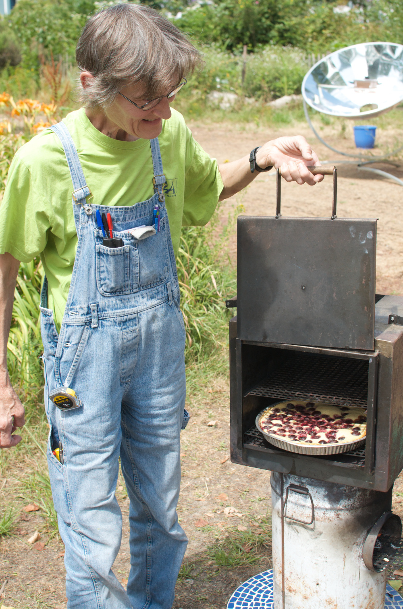

#2nd workshop - Bordeaux, France
[Les Jardins d’Aujourd’hui](http://association-les-jardins-daujourdhui.asso-web.com/)
###Bordeaux, France, June 2014
---
In France, in Bordeaux in June 2014, the association «Les Jardins d’Aujourd’hui» hosted about twenty participants for the meeting and vermicomposting, «lasagna» composting, cooking by solar oven workshops. They also visited the various collective gardens and met gardener from Bordeaux.

---

---

---

---

---

---

---

---

---

---

---
