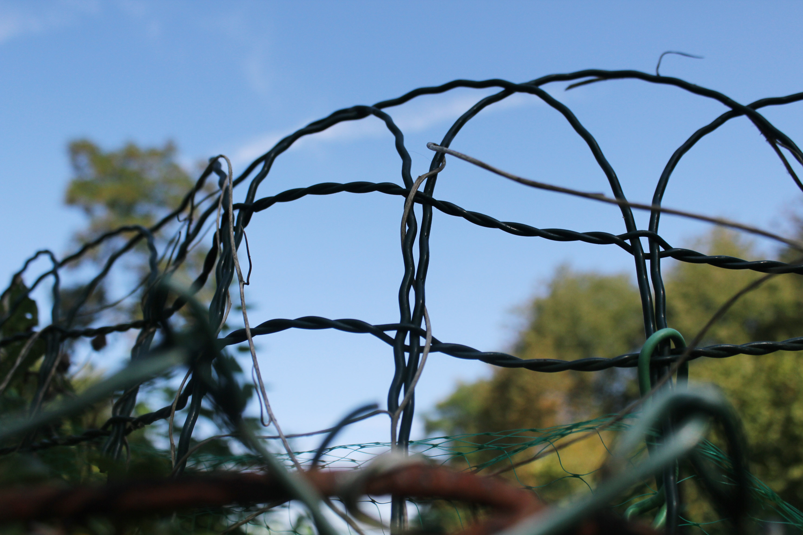
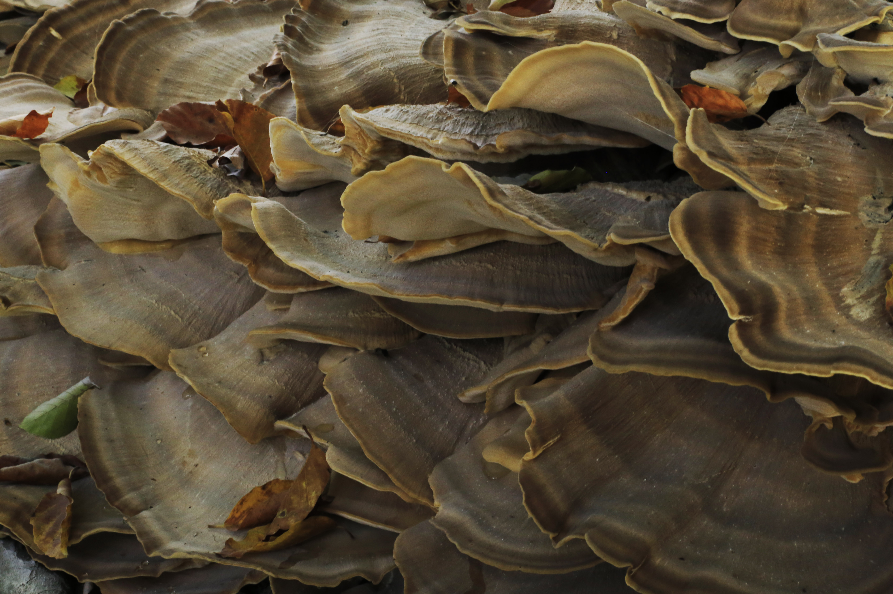
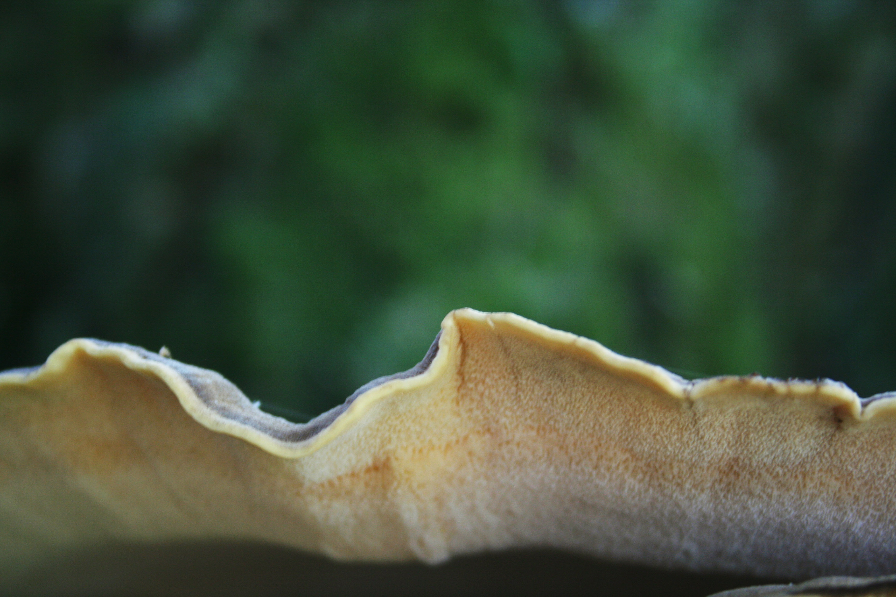
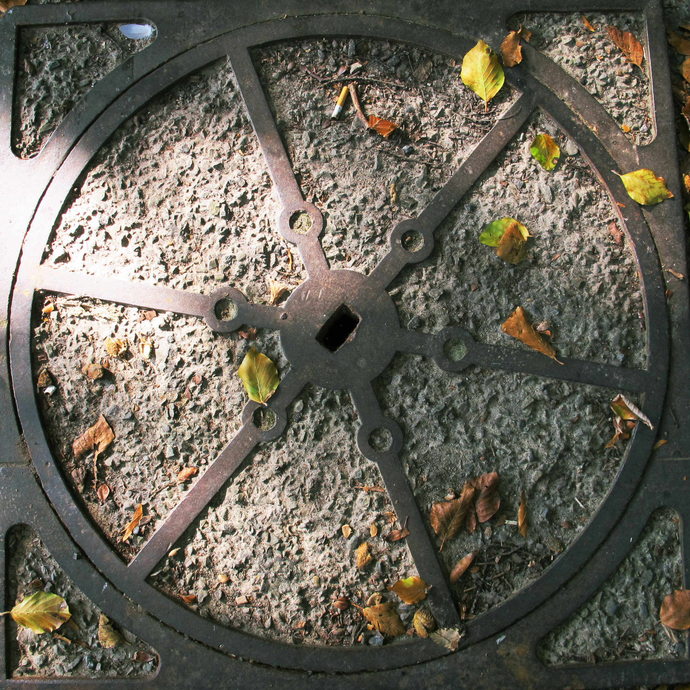
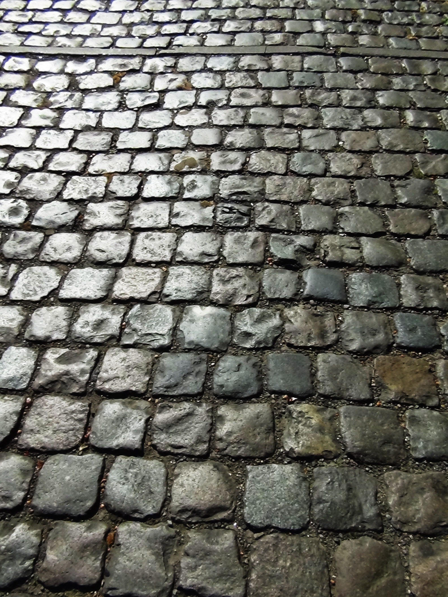
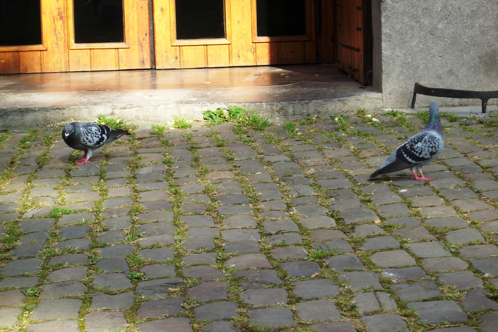
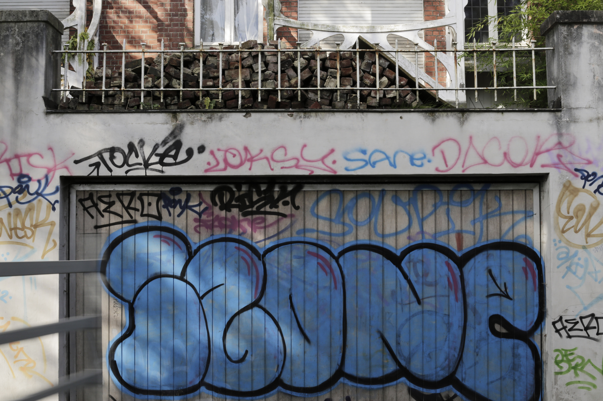
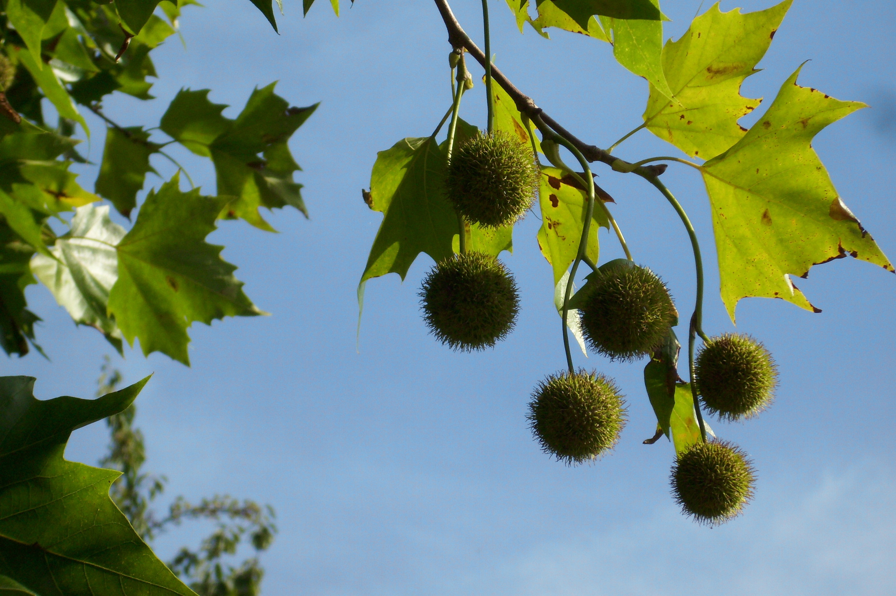
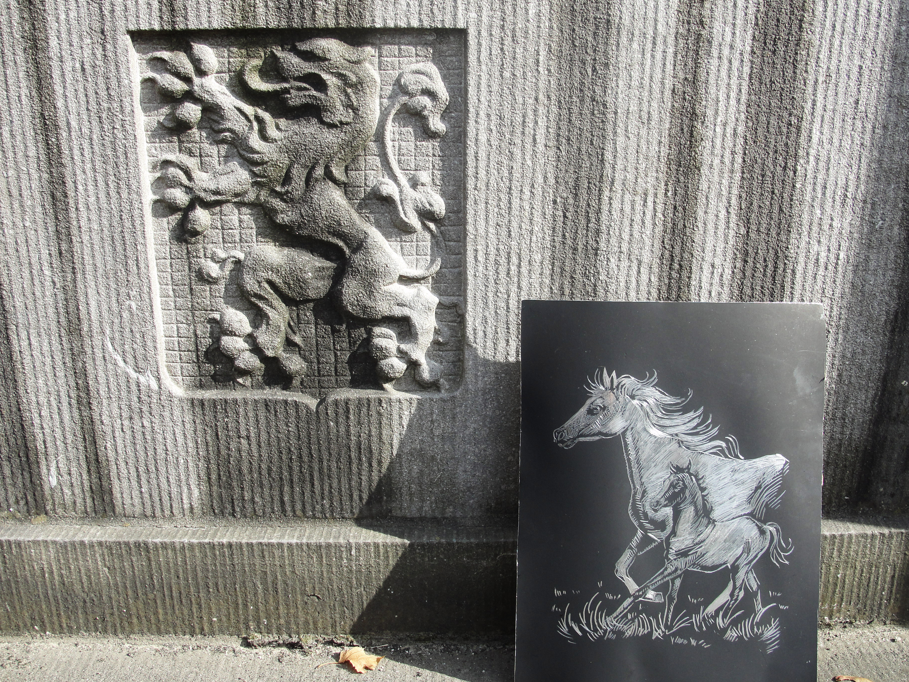
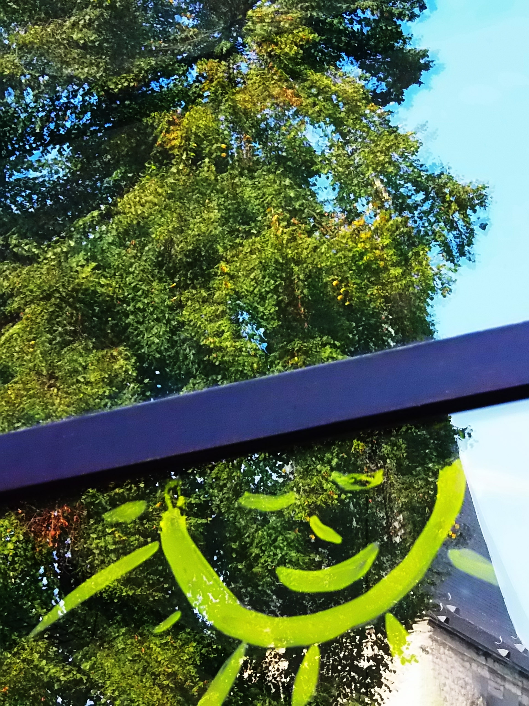

#3rd Workshop - Bruxelles, Belgium
[La Vénerie](http://lavenerie.be)
Bruxelles, Belgium, September 2014
---
In September 2014, the third meeting of workshops reunited over thirty participants in Watermael-Boitsfort, organized by the Cultural Center «La Vénerie». 

On the program: photography workshop, green walk accompanied by our staff, cooking of forgotten plants workshop.

A selection of picture taken by the participants from our partners (Cluj, Warsaw, Bordeaux, Zagreb, Bruusels) of the photo workshop led by Michel Gelinne.

