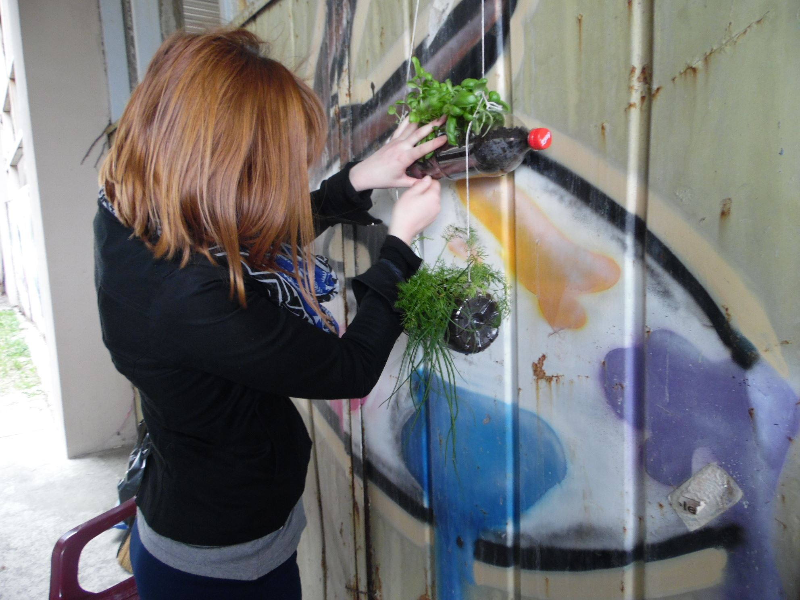
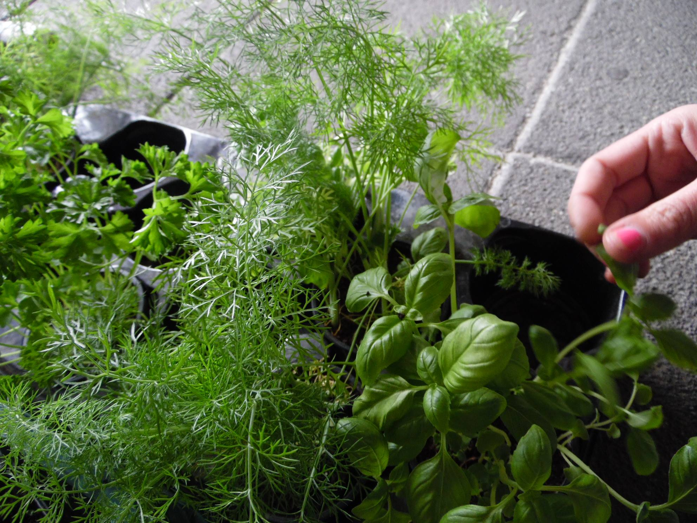
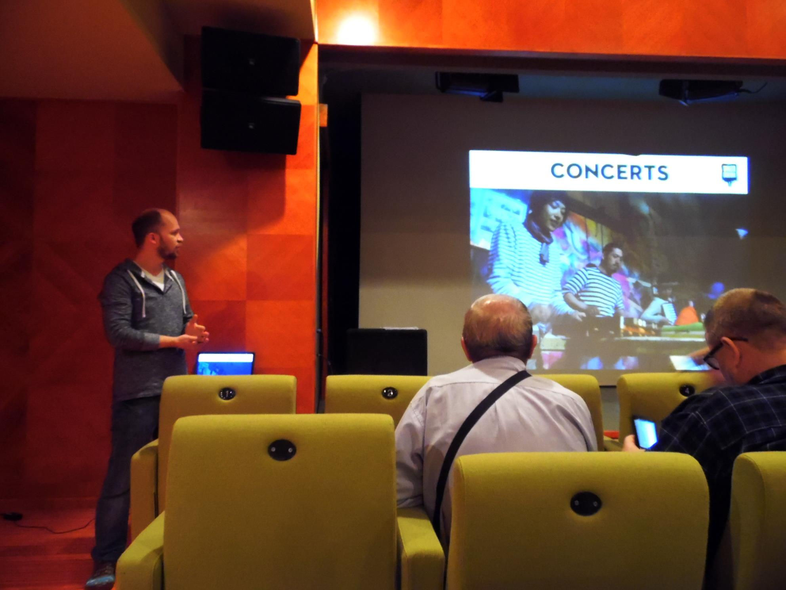
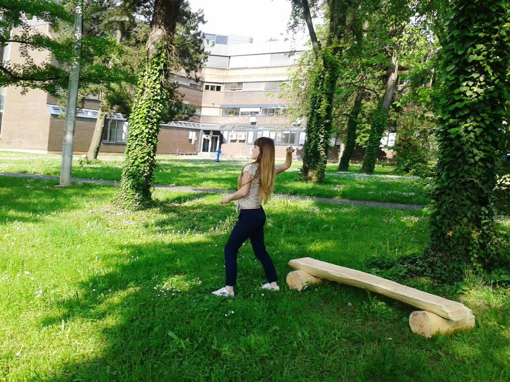

#4th Workshop
[Narodno sveuciliste Dubrava](http://www.ns-dubrava.hr)
##Zagreb, Croatia, April 2015
---

Narodno sveuciliste Dubrava (Dubrava Peoples University) made several local events and workshops on local level about the «Recreate your neighborhood» project.

During the World Landscape Architecture Month 2014, from 23 to 26 of April, we represented the project on University of Agronomy, landscape architecture in Zagreb to students and professors, since they are long term partner with Dubrava Peoples University. Their students are involved actively in our international project.

After the transnational meeting in Romania our participants made workshop on 24 April of seed bombing, and on 1 of May, International Sunflower Guerrilla Gardening Day they threw seed bombs all around the city.

During our biggest manifestation called Days of Dubrava, which is held annually in June, we made a workshop and presentation of the «Recreate your neighborhood» project in our institution. On Saturday 14 of June, participants in Romania were leaders of workshop in Dubrava for local community. They also shared their experience gained in Romania with local participants.



---


---


---


---


---


---


---


---


---


---


---


---


---


---


---


---


---


---


---


---


---


---


---


---