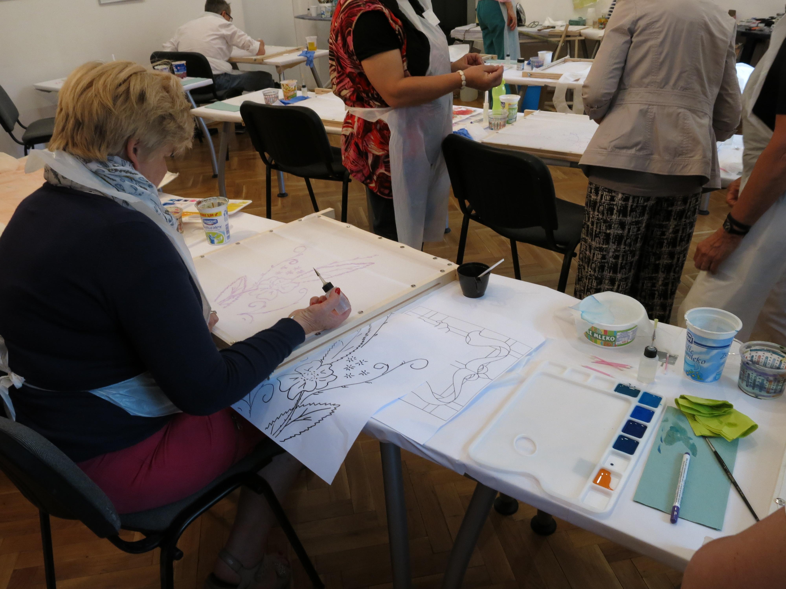
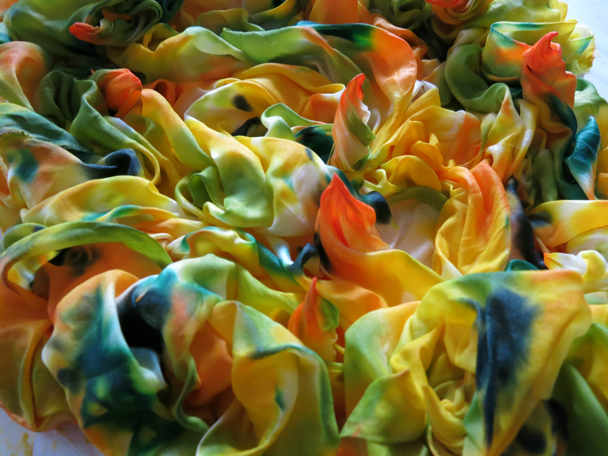
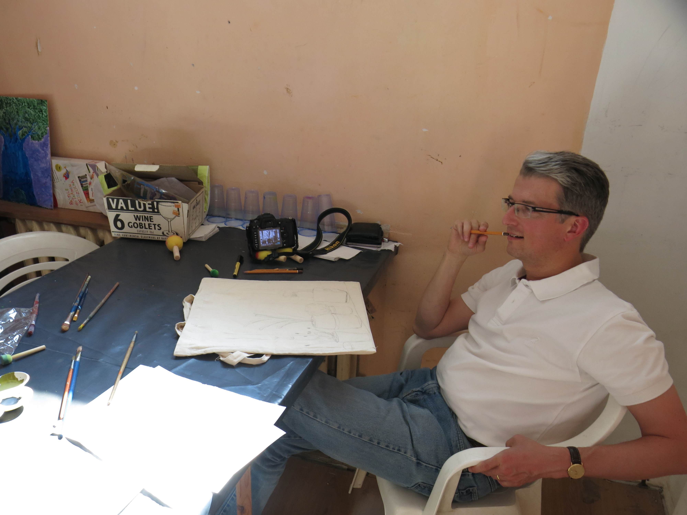
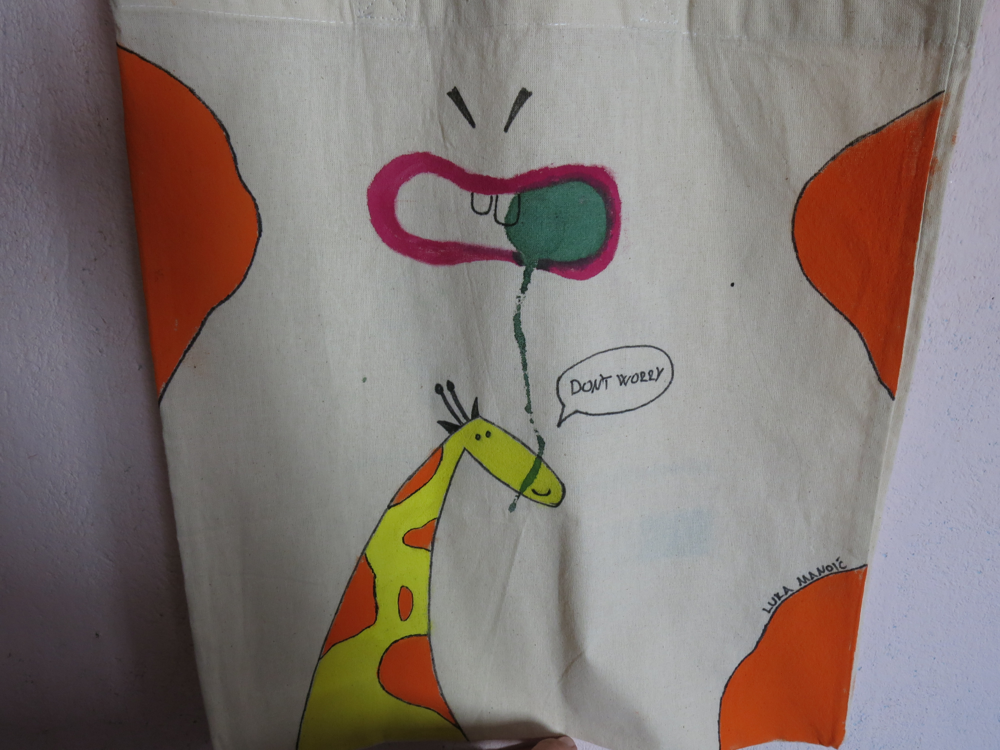
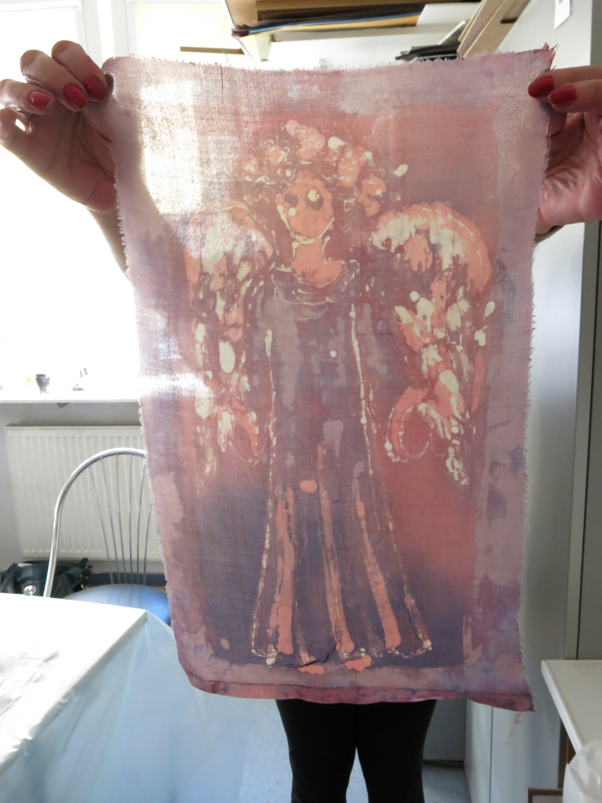
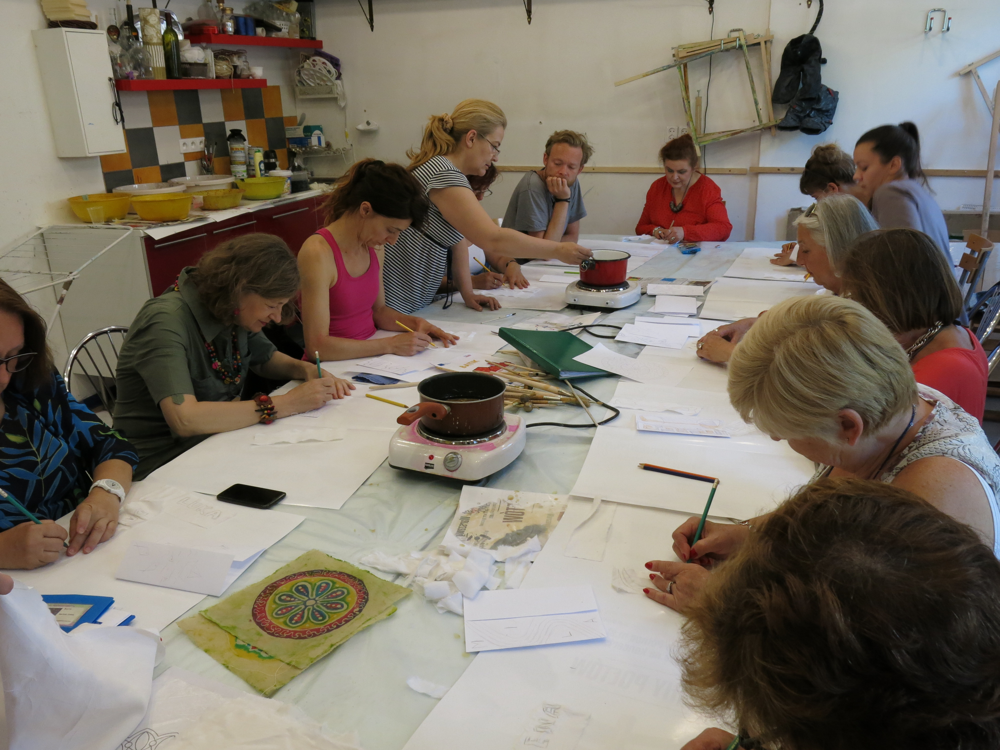

#5th Workshop

##Warsaw, Poland, June 2015
---

###Batic
Batic is a technique of decorating cloth in which wax and dye are used. In the process, part of a fabric is covered with wax. When the whole thing is dyed the waxed areas keep the original color. It may be repeated over and over and new colours and patterns may be applied. Batic originated in Indonesia where it is considered to be part of the ancient national tradition. Recently it has become popular in the West and Praga Culture Center has organized batic workshops for a few years.

###Fabric painting

Silk painting originated in China where silk itself were first developed and over millennia has found its way to every part of the world. As a tightly woven fabric silk is easy to be painted if a crafter wants to create images but if the main objective appears to be simply decorative and restorative approach any fabrics is fine. You may paint scarves or other clothing. You may make brand-new looking wall hangings, pillows, napkins, drapes, even upholstery. Using the technique for restoring worn-out pants, jackets or shirts may give old clothes a new style. It is amazing how endless thrifting and recycling possibilities you have at hand. Praga Culture Center has organized the workshops for the public.

###The main idea.
Both, batic and fabric painting workshops are arts and craft at the same time and both workshops are organized with the single main idea in mind: how to beautify your surroundings and add extra life and colours to everything around you? Wouldn’t it be nicer to work around your house or in a garden freshly bright clothing? The learners have a great opportunity to discover their own, often unrealized before, creative potentials while working together in a friendly, non-competitive, international atmosphere. Each workshop results also in a concrete, physical artifacts that may be perfectly used to recreate your neighbourhood.

warsaw_55.jpg