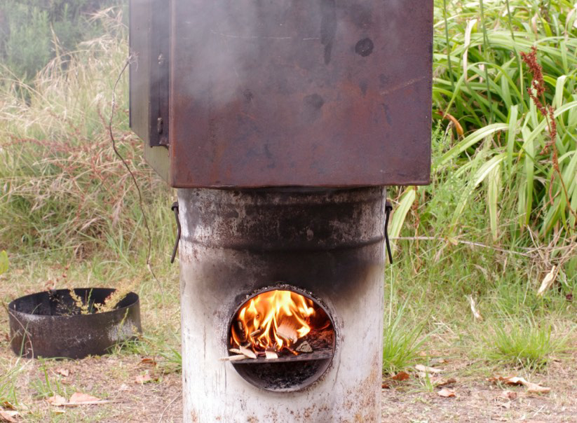

# Partners:

---

##Belgium - La Vénerie

La Vénerie offers the workshop «  Safari photo dans les potagers urbains ». A photography session about urban kitchen gardens in Watermael-Boitsfort, as the seasons change.

* Explore and show the dark side of gardens and kitchen gardens.
* Exercise your eyes and the composition of the picture.
* Use the light, lines and nature’s materials.
* Search and learn the name of plants, animals and insects encountered.

##Croatia - Dubrava Center

Dubrava Cultural Center was founded by the city of Zagred in 1958. It’s mission is lifelong learning and cultural diffusion. In terms of programme and human resources the center is among the biggest cultural institutions in the city of Zagreb, and in Croatia as a whole.

Based in Dubrava, a borough located in the eastern part of Zagreb, the center benefits from a rich multiethnic and multicultural community of 150,000 people. It strives to engage local population in various artistic, cultural and educational activities, taking place on two different locations.

There are 38 employees working in the center, and a number of regular contributors to the programmes, ranging from new-media artists, theatre directors, actors to biologist, teachers, journalists and designers.

Dubrava Cultural Center consists of several operational units, managed by their respective team leaders, and dedicated to different artistic, cultural and educational purposes : Events and Projects Center, Visual Arts Center, Children Theatre Dubrava, Multimedia Center, Music Center, Dance Center, Traditional Croatian Culture Center, Production Center, Language Center, Computing Center, Programs for elderly people, Regional and international programmes.

The majority of the programmes are brought to life locally. Each year up to 100,000 people of all age groups participate in the socio-cultural activities organized by the Center. Out of these, 1,800 participate in regular annual educational activities.

The activities of the center are not only limited to Dubrava area and it also organizes activities and events for the citizens of Zagreb and other parts of Croatia. The center also works together with similar international institutions, various festivals, associations and artists. Currently, the international cooperation and exchange are important guidelines to follow.

##France - Les Jardins d'Aujourd'hui

Over the last 28 years, the association «Les jardins d’aujourd’hui» have been developing techniques and original knowledges in terms of creating and managing community gardens, while promoting alternative and natural ways of growing food plants.

It also offers workshops for all, on environmental issues such as food well-being, water saving, organic waste recycling and natural gardening techniques.

The association is structured around two resources places landscaped and managed by its employees and volunteers : The garden of Bougainville and the plot of the Botanical Garden. Workshops also take place there.

The association works with two allotment gardens, the first is located in the district Les Aubiers with 70 plots and the second in the neighborhood Bacalan with 24 plots.

A community garden is a single piece of land gardened collectively by a group of people. Depending on the context and the inhabitants, organization and objectives differ.

Beyond the 6 gardens it supports, our association is also involved in networking with other local players, throughout the city of Bordeaux and its suburbs, on environmental, food and social issues through animations, training or consulting.

**Aims and missions of the association.**

Objectives:

* To strengthen the local social network.
* To fight against exclusion using collective actions and natural urban gardening as support.

Skills :

* It develops original techniques and spreads knowledge in social support and natural gardening.
* It participates in the creation and in the management of project of shared and ecological public places, based on the sustainable development of a «neighborhood life» in urban areas.

Aims :

* To facilitate the creation of social ties and public participation.
* To cultivate health through food and gardening.
* To promote and preserve biodiversity.
* To reduce and recycle waste.

Supporting a collective garden is :
* To guarantee an egalitarian and democratic framework.
* To guarantee a local dynamic by the management of the site and the development of specific events within and outside the group.

##Poland - Dom Kultury PRAGA

Praga Cultural Centre (Dom Kultury PRAGA) is a public institution established in Warsaw in November 2002. Situated in Praga Polnoc district, aims primarily to animate cultural activities locally and enable an easy access to quality creative workshops and art courses. Praga offers a variety of arts and crafts, musics, films and theatre classes, courses and workshops for children, teenagers and adults. A special offer is designed for the disabled and elderly people willing to get engage in the local cultural activities.

The character of the district, facing various social problems and the recent gentrification process, influences the program of the center. Therefore, a range of workshops and projects are developed with local non-governmental organizations and artists, schools or public institutions, tackles current social issues. To enable a wider access to cultural activities, many of the workshops and special events are free of charge for the participants.

Besides, thanks to innovative projects developed by the center, it also attracts the audience from other districts as well as Warsaw’s suburban areas. Among these projects, music festivals are highly acclaimed such as EtnoPraga and Contemporary Jewish Music Festival, both inspired by cultural diversity of the district. Involving collaboration with artists, organizations and institutions from various countries, they also bring an international dimension to the programme of the center.

##Romania - Asociația uzinaduzina
[Asociația uzinaduzina](http://uzinaduzina.org)

Engaging the work of a small, energetic and dedicated team of young practitioners, Uzinaduzina aims to support urban culture in Transylvania. Working with young and adult audiences, the team attempts to prompt them to discover the latest trends, but also to remember and acknowledge their recent past, thus contributing to a culture of dialogue between the two age groups.

Our name stands for « a dozen work initiatives in a factory » since we wanted this organization to allow each of us to further our research and develop projects and events that would concord with our advocacy initiatives. It has so far proven a fertile environment and we believe this type of association particularly suits young democracies where a not-for-profit culture is still to be developed. It also suits university centers, where research hubs are valuable for students and graduates alike.

Due to our academic and professional backgrounds, we are attentive to issues related to material and immaterial heritage as well as changes in the public space. In the past, we have organized storytelling events and colored retroprojections (a special pastime for children growing up in the ‘80s in communist Romania).

We are concentrating our initiatives around the following activity areas :

* immaterial cultural heritage
* digital preservation of cultural artifacts
* traditional crafts reinterpreted from an urban perspective
* the evolution of public space in post-communist Romania
* anthropological research
* contemporary and outsider art
* civic education and human rights

